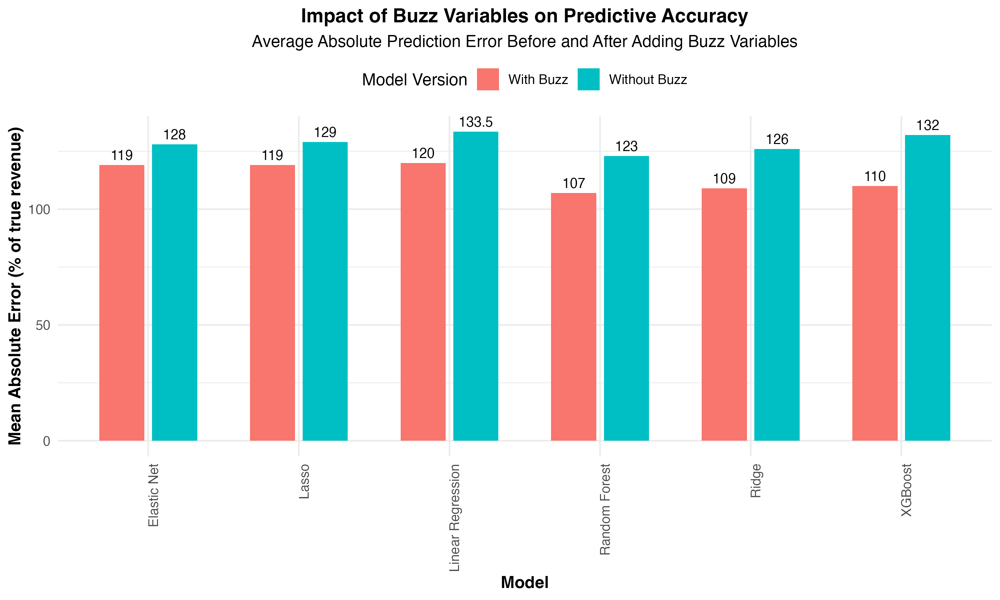
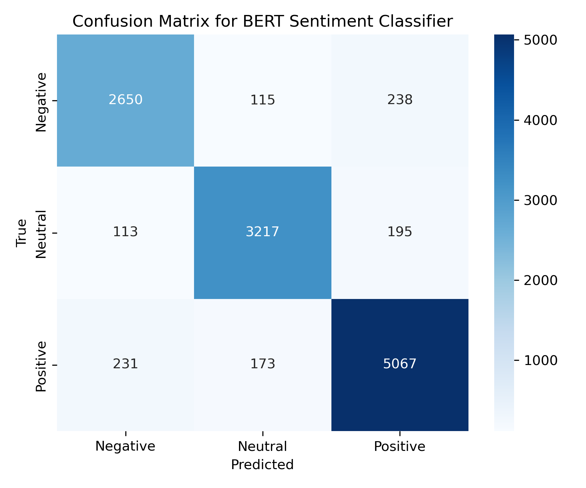
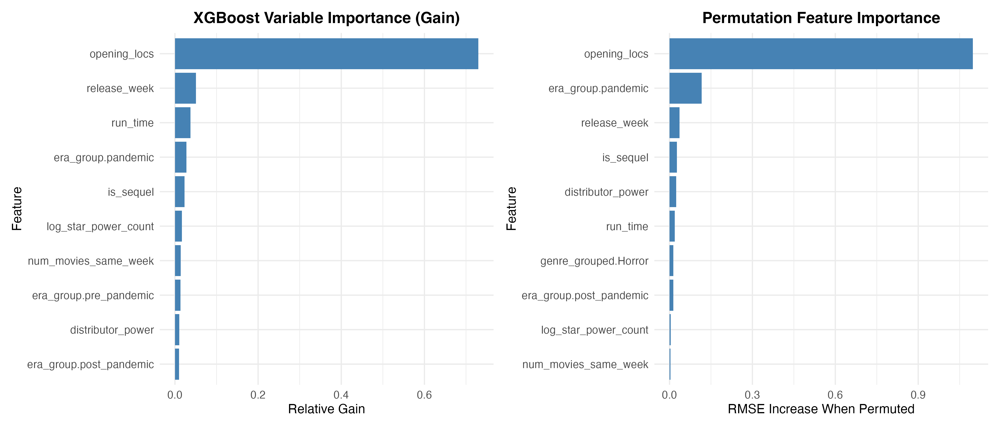
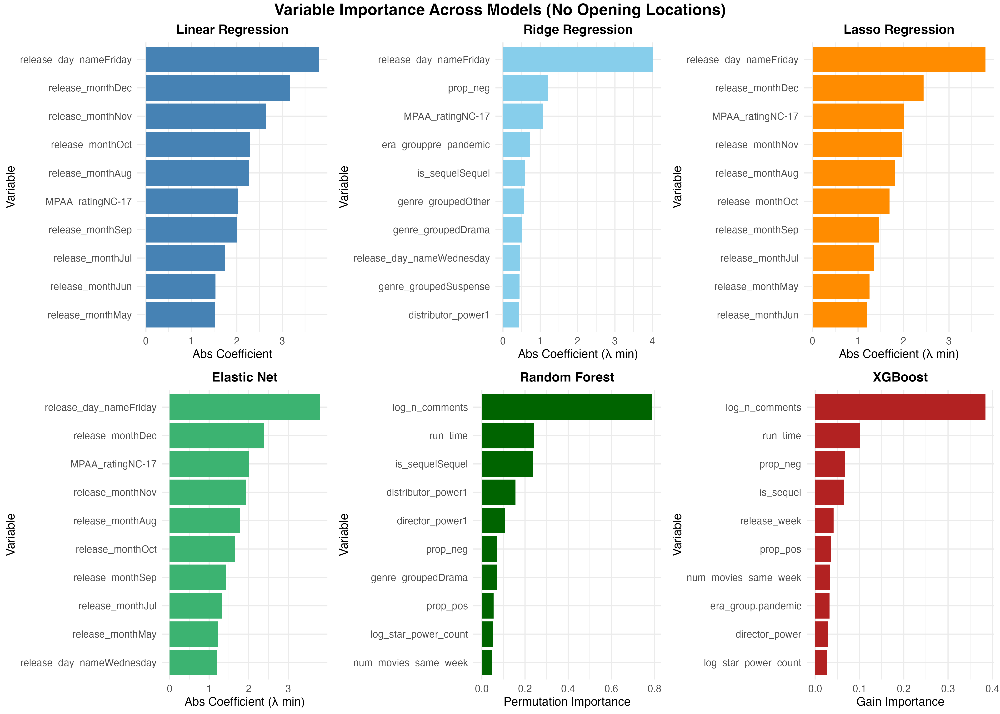
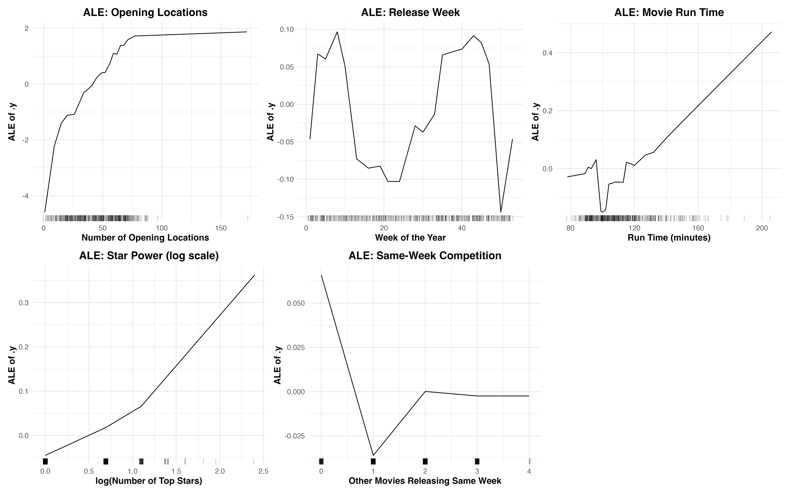
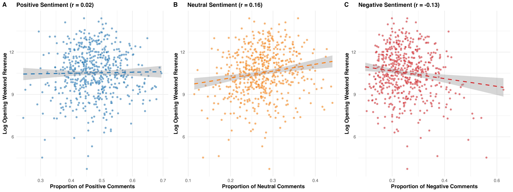

# Movie Revenue Forecasting Using Pre-Release Signals & NLP


---

## Overview

Predicting box office revenue before a film releases is a high-stakes problem for content acquisition teams: decisions worth tens of millions of euros are made on incomplete information. This project builds a machine learning pipeline that forecasts a movie's **opening weekend revenue** using only signals available **before** the theatrical release date — no post-release data is used anywhere in the model.

The pipeline combines YouTube trailer comment sentiment (scraped and classified using a fine-tuned BERT model) with structural features such as star power, distributor strength, release timing, and competition. Models range from OLS regression to XGBoost, evaluated on a held-out test set of 112 films. The project was completed as an MSc thesis in partnership with a European media company.

---

## Results Summary

The analysis is structured in two parts, reflecting a key methodological concern about endogeneity.

### Part 1 — Does buzz add value independent of distribution decisions? (Section 5.1)

Number of opening locations (`opening_locs`) is one of the strongest predictors of opening weekend revenue, but it is also likely **endogenous**: studios factor in pre-release trailer buzz when deciding how widely to release a film. A linear regression of `opening_locs` on buzz variables confirms this — comment volume is strongly and significantly associated with the number of opening locations (p < 0.001).

To isolate the pure predictive value of buzz, all models in this section **exclude `opening_locs`**.

| Model | No Buzz (MAE) | Buzz Volume Only (MAE) | Buzz Vol + Valence (MAE) | Best improvement |
|-------|--------------|----------------------|--------------------------|-----------------|
| Linear Regression | 0.859 | 0.815 | 0.809 | −5.8% |
| Ridge Regression | 0.830 | 0.784 | 0.770 | −7.2% |
| Lasso Regression | 0.841 | 0.811 | 0.805 | −4.3% |
| Elastic Net | 0.841 | 0.810 | 0.804 | −4.4% |
| Random Forest | 0.819 | 0.764 | 0.763 | −6.8% |
| **XGBoost** | 0.855 | 0.784 | **0.772** | **−9.7%** |

*MAE on log-scale, evaluated on held-out test set. All models exclude `opening_locs`.*

**Key finding:** Adding pre-release buzz variables improves every model without exception. XGBoost benefits the most, with a 9.7% MAE reduction — and in proportional revenue terms, XGBoost's average prediction error falls from **132% to 110%** of true revenue when buzz is added. Tree-based models (XGBoost, Random Forest) show substantially larger gains from buzz than linear models, suggesting the effect of buzz on revenue is non-linear and context-sensitive — a finding not recognised in prior literature.



**An important nuance:** In tree-based models, `log_n_comments` (comment volume) is ranked as the top predictor when `opening_locs` is excluded. Linear models do not rank buzz among their top features — they rely instead on release timing, MPAA rating, and genre. This divergence suggests buzz operates through non-linear interactions that OLS-type models cannot capture.

---

### Part 2 — What is the best overall model? (Section 5.2)

This section reintroduces `opening_locs` to establish benchmark performance comparable to prior literature. Adding this single variable produces dramatic improvements across all models.

| Model | Feature Set | MAE (without `opening_locs`) | MAE (with `opening_locs`) | Improvement | Avg % Error |
|-------|-------------|------------------------------|---------------------------|-------------|-------------|
| Linear Regression | Vol + Valence | 0.809 | 0.573 | −29% | ~55.7% |
| Ridge Regression | Vol + Valence | 0.770 | 0.574 | −25% | — |
| Lasso Regression | Vol + Valence | 0.805 | 0.587 | −27% | — |
| Elastic Net | Vol + Valence | 0.804 | 0.582 | −28% | — |
| Random Forest | Vol + Valence | 0.763 | 0.606 | −21% | — |
| **XGBoost** | **No Buzz** | **0.855** | **0.540** | **−37%** | **~47%** |

**The best-performing model is XGBoost without buzz variables, which achieves a 37% lower MAE than the same model without `opening_locs`.** For a film with the sample mean opening weekend revenue of €112,891, XGBoost's typical prediction miss is €53,059 — roughly €10,000 narrower than OLS regression. Against a naive baseline (linear regression with no buzz and no opening_locs, MAE 0.859), XGBoost's final MAE of 0.540 represents a **37% reduction**.

The fact that XGBoost performs best *without* buzz variables in the full-feature setting (Section 5.2) is consistent with the endogeneity interpretation: once `opening_locs` is included, it already encodes much of the signal that buzz was carrying in Section 5.1.

---

## BERT Sentiment Classifier

Before sentiment features could enter the forecasting models, a domain-specific sentiment classifier was needed. Generic pre-trained classifiers perform poorly on informal YouTube comment language (slang, emoji, hyperbole). A two-stage approach was used:

1. **Weak labelling** — VADER was used to generate noisy sentiment labels at scale across the full comment corpus
2. **BERT fine-tuning** — `bert-base-uncased` was fine-tuned on the weak labels using Optuna Bayesian hyperparameter search across 8 trials

The resulting classifier achieves strong three-class (Positive / Neutral / Negative) performance on the held-out test set:



Most errors are adjacent-class confusions (e.g. Neutral predicted as Positive) rather than polar errors — which is the best-case failure mode for downstream sentiment aggregation.

---

## Feature Importance (Full Feature Set — With `opening_locs`)

Two complementary importance metrics were computed for the best XGBoost model: **Gain** (contribution to split quality across all trees) and **Permutation Importance** (test RMSE degradation when a feature is shuffled).



Both methods agree: `opening_locs` dominates by a large margin, followed by `release_week`, `run_time`, pandemic era, sequel status, and star power. The feature importance grid below shows the top 10 drivers across all six model families:



---

## ALE Plots — How Features Drive Revenue

Accumulated Local Effects (ALE) plots reveal the direction and magnitude of each feature's effect on predicted log revenue, averaged across the data distribution. These are computed on the best XGBoost model (with `opening_locs`, without buzz).



Key findings:

- **Opening Locations** — strong positive non-linear relationship. The marginal effect increases steeply up to ~60 locations and then tapers off, suggesting diminishing returns beyond a wide release threshold.
- **Release Week** — clear cyclical pattern with peaks in weeks 4–7 (late January–February) and weeks 36–42 (September–October). The lowest revenues are predicted for weeks 17–25 (late April–June, coinciding with student exam season) and weeks 50–52 (Christmas, when family activities compete with cinema).
- **Movie Run Time** — generally positive above 120 minutes. Longer films likely proxy for production value and prestige, which correlates with higher opening weekend expectations.
- **Star Power** — log-linear positive relationship. The benefit of having top stars rises steeply at low counts and continues with diminishing returns — going from zero to one A-list actor matters more than adding a tenth.
- **Same-Week Competition** — a pronounced threshold effect: even one competing release causes a noticeable revenue drop. However, additional competitors beyond one do not compound the effect, likely because high-demand periods (holidays) attract multiple titles simultaneously.

---

## Sentiment vs Revenue

The scatter plots below show the raw relationship between BERT-derived sentiment proportions and log opening weekend revenue:



The OLS coefficient for log comment volume is 0.315 (p < 0.001), implying a 10% increase in pre-release comment volume is associated with a ~3.15% rise in opening weekend revenue — roughly €31,500 for a film expected to earn €1M. Sentiment valence (proportion positive/negative) shows the expected direction but is not statistically significant in the linear framework, consistent with the finding that buzz effects are better captured by non-linear models.

---

## Methodology

### Data Sources
- **YouTube trailer comments** — scraped via the YouTube Data API v3 from official movie trailers, filtered to English-language comments published before the film's release date. ~1.9 million comments across 17 batches covering 2019–2024.
- **Public movie metadata** — distributor rankings, star and director power scores, release schedules (scraped from [The Numbers](https://www.the-numbers.com))
- **Proprietary box office data** — internal revenue figures and theatrical data provided by the media company partner (not included in this repository; see `data/README.md`)

### Python Pipeline

| Step | Notebook | Description |
|------|----------|-------------|
| 1 | `01_scraping_trailer_comments.ipynb` | Collect pre-release YouTube comments via the Data API v3; filter by language and date |
| 2 | `02_weak_labelling_vader.ipynb` | Apply VADER sentiment scores to generate weak labels for BERT training data |
| 3 | `03_holiday_control.ipynb` | Engineer a binary holiday-release flag using the `holidays` package |
| 4 | `04_vader_testing.ipynb` | Exploratory calibration of VADER on movie comment language and emoji handling |
| 5 | `05_bert_finetuning.ipynb` | Fine-tune `bert-base-uncased` on weak labels using Optuna hyperparameter search; generate sentiment scores for the full corpus |

### R Pipeline

| Step | Script | Description |
|------|--------|-------------|
| 6 | `06_scraping_control.R` | Scrape distributor market share and annual movie release tables from The Numbers |
| 7 | `07_modelling_and_evaluation.R` | Feature engineering, two-part model evaluation (with/without `opening_locs`), ALE plots, and feature importance analysis |

---

## Repository Structure

```
thesis-movie-revenue-forecasting/
├── README.md
├── requirements.txt          # Python dependencies
├── r_requirements.txt        # R package list
├── data/
│   ├── README.md             # Dataset descriptions, sources, and exclusions
│   ├── all_movies_cleaned_combined.csv
│   ├── movies_20XX_subset_clean.csv (× 6 years)
│   ├── distributors_20XX.csv (× 6 years)
│   ├── top_1000_grossing_actors.csv
│   ├── top_1000_grossing_directors.csv
│   └── youtube_comments/
│       ├── batch_1_with_ids.csv … batch_17_with_ids.csv
│       ├── comments_corrected_21_22.csv
│       ├── comments_corrected_23_24.csv
│       └── video_ids_with_links.xlsx
├── python/
│   ├── 01_scraping_trailer_comments.ipynb
│   ├── 02_weak_labelling_vader.ipynb
│   ├── 03_holiday_control.ipynb
│   ├── 04_vader_testing.ipynb
│   └── 05_bert_finetuning.ipynb
├── R/
│   ├── 06_scraping_control.R
│   └── 07_modelling_and_evaluation.R
└── results/
    ├── figures/
    └── metrics/
```

**Why both Python and R?** Scraping and deep learning (BERT, API calls) were implemented in Python. Feature engineering, statistical modelling, and visualisation were done in R using `tidyverse`, `glmnet`, `ranger`, and `xgboost`, which offer mature interfaces for regularised regression and interpretable ML.

---

## How to Run

### Python setup

```bash
python -m venv venv
source venv/bin/activate   # Windows: venv\Scripts\activate
pip install -r requirements.txt
```

Set your YouTube Data API key before running the scraping notebook:

```bash
export YOUTUBE_API_KEY=your_api_key_here
```

Run notebooks in order (1 → 5) from the `python/` directory using `jupyter notebook`.

### R setup

```r
pkgs <- readLines("r_requirements.txt")
pkgs <- pkgs[!grepl("^#|^$", pkgs)]
install.packages(pkgs)
```

Run scripts in order (6 → 7) from the `R/` directory. Update the `setwd("../data")` call at the top of each script to point to your local data folder.

---

## Data

Public data included in this repository:
- **YouTube trailer comments** — scraped from publicly accessible YouTube videos using the official Data API (~1.9M comments, 2019–2024)
- **Public movie metadata** — release dates, distributor rankings, star and director power scores from public box office databases

**Proprietary data used during the thesis is excluded.** This includes internal viewership data, territory-level revenue figures, and ticketing data from the media company partner. Each excluded file is clearly marked with a `# NOTE: This file is not included in the public repository` comment in the R scripts. Models trained on the full dataset may not be fully reproducible from the public data alone.

See [`data/README.md`](data/README.md) for a full list of datasets, sources, and exclusions.

---

## Tech Stack

| Layer | Tools |
|-------|-------|
| Data collection | YouTube Data API v3, `rvest`, `httr` |
| NLP / Sentiment | VADER (`vaderSentiment`), BERT (`bert-base-uncased` via HuggingFace `transformers`) |
| Hyperparameter search | `optuna` (8 trials, Bayesian optimisation) |
| ML models | LASSO / Ridge / Elastic Net (`glmnet`), Random Forest (`ranger`), XGBoost (`xgboost`) |
| Model interpretation | ALE plots (`iml`), permutation importance (`DALEXtra`) |
| Data wrangling | `pandas`, `numpy`, `tidyverse`, `dplyr`, `lubridate` |
| Visualisation | `ggplot2`, `matplotlib`, `seaborn`, `cowplot`, `patchwork` |

---

## Academic Context

**Degree:** MSc Data Science & Marketing Analytics
**Institution:** Erasmus University Rotterdam
**Year:** 2025
**Grade:** 8.0 / 10
**Industry partner:** European media company (anonymised)
